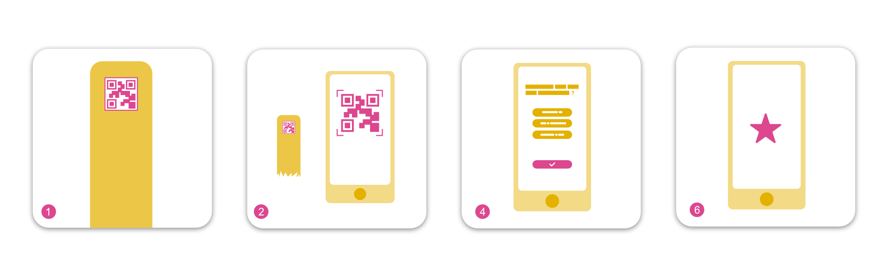
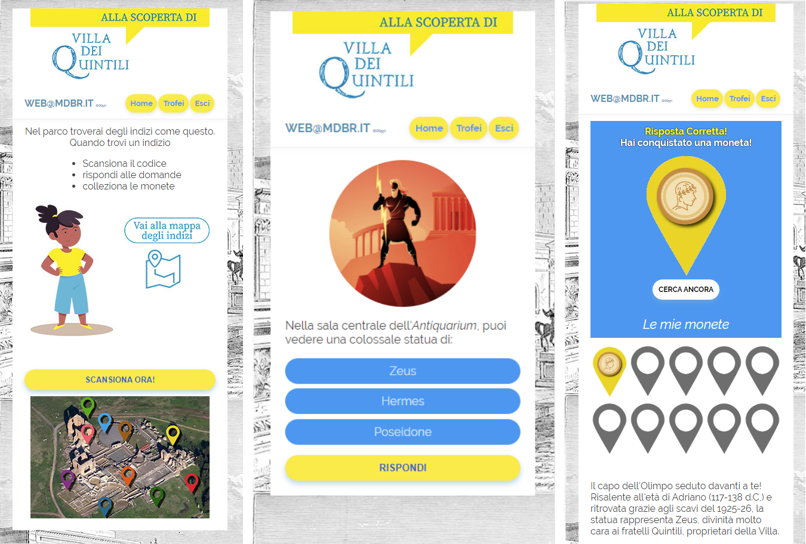

# Explora Scavanger Hunt Web App


[](https://mdbr.it/en/) [](https://en.wikipedia.org/wiki/Web_application)


A game of Scavanger Hunt implemented in Python Flask, serving an Admin Dashboard for setting up the game and a client for players.


Tested and running in VPS with Ubuntu Server 18.04 LTS

- [Introduction](#introduction)
- [Development](#development)
- [Production WSGI Server with Apache](#apache)
- [Firebase services](#firebase)
- [Project additional infos](#infos)


## <a name="introduction"></a>Introduction
Scavenger hunt is a web platform for a QR reading based quiz game.
Through any mobile device camera it can scan different QR codes that start different quizes.
For any scanned QR the web platform serves a set of question and possible answers (behaving like radio buttons). 
If the answer given by user is correct the platform serves a badge with a hint of the position of next QR to scan.

### How it works
1. User is presented with a first QR
2. User scans QR
3. User gets redirected to web app
4. User is presented a question and answers
5. User answers correctly
6. User is given a victory collectible item
7. User moves to the next QR code



## <a name="development"></a>Development
```bash
# Clone repo
git clone <repo>

# Install pipenv if you don't have it
pip3 install pipenv

# Activate virtual env
python3 -m pipenv shell

# Install dependencies
pipenv install

# Initialize application
pipenv run init

# Run DEV server locally on port 5000
pipenv run dev_server

# or

# Run DEV server accessible from remote on port 5001
pipenv run dev_server_remote

```

## <a name="apache"></a>Production WSGI Server with Apache

- Clone repo to VPS, after setting DEPLOY_VARS.sh
`./deploy.sh`

- Connect with ssh to server and 
`~/install_caccia_apache.sh`

See [this article](https://medium.com/@prithvishetty/deploying-a-python-3-flask-app-into-aws-using-apache2-wsgi-1b26ed29c6c2) for more info. 


## <a name="firebase"></a>Firebase services
This project uses Firebase for auth services. To set this up correctly,  create a Firebase project and follow these instructions:

- place firebase.json in `instance` folder, rename `FIREBASE_CONF` value in `__init__.py`

- place `firebaseConfig.js` in `caccia_server/static` folder

## <a name="infos"></a>Project additional infos

### Project purpose
Scavenger hunt has been developed as a game to explore archeological and natural areas and to learn interesting facts about them.
These sites have been previously equipped with multiples QR reading stations, placed on the areas hotspots.



Examples of areas where Scanvenger hunt has been used are:
- Villa dei quintili – Roman villa archeological site
- Explora botanical garden
- Centrale del latte di Roma – dairy production facility

### Related Explora's project

- [Whack-a-mole]()
